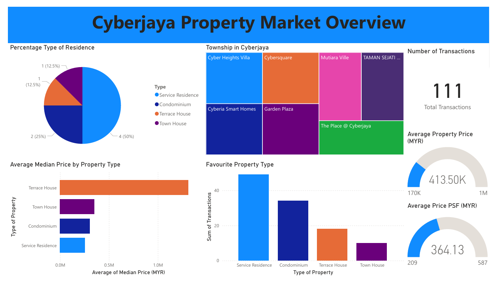

# Cyberjaya Property Market Dashboard 🏡📊  

This **Power BI dashboard** provides insights into **property transactions** in **Cyberjaya, Selangor** using visual analytics.  

## 📌 Key Features  
✅ **Total Transactions & Property Distribution**  
✅ **Median Price & Price per Square Foot Analysis**  
✅ **Most Active Townships in Cyberjaya**  
✅ **Data-Driven Insights for Real Estate Decisions**  

## 📂 Files Included  
- **Cyberjaya_Property_Dashboard.pbix** → Power BI file  
- **Screenshot.png/** → Image previews of the dashboard  
- **Cyberjaya_Property_Market_Overview.pdf** → Exported report  

## 🛠 Technologies Used  
- Power BI  
- DAX  
- Data Visualization  

## 📸 Preview  
  

## 🚀 How to Use  
1. Download the `.pbix` file and open in **Power BI Desktop**.  
2. Explore the **interactive dashboard** with filters and visuals.  

---

🔗 **[Connect on LinkedIn](https://www.linkedin.com/in/muhamad-afiq-firdaus-744623299/)**  
📩 Feel free to reach out if you have any questions! 🚀
